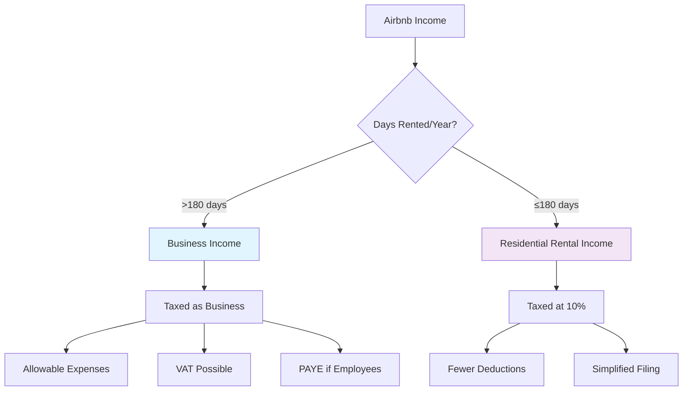

# **🏡 Airbnb Rental Compliance: Comprehensive Kenyan Guide**

**Advisor:** Sarah Mwangi, CPA(K) – Specializing in Short-Term Rental Taxation

---

## **⚠️ CRITICAL DISCLAIMER**

> _This guidance addresses Kenyan tax obligations for Airbnb/rental businesses based on current Income Tax Act, VAT Act, and Tourism Regulations. Laws change frequently—particularly for digital platforms. Always verify with KRA and your ICPAK accountant before filing. I provide educational guidance, not legal tax advice._

---

## **🎯 Understanding Airbnb’s Kenyan Tax Withholding**

### **Airbnb’s Mandatory KRA Withholding (Effective 2025)**

```
🚨 CRITICAL NEW RULE:
• Airbnb Kenya now WITHHOLDS 5% of all payments
• This is NOT your final tax
• It's an ADVANCE TAX PAYMENT
• You MUST still file returns
• You MUST reconcile what Airbnb withheld vs. your actual liability

📌 EXAMPLE:
Monthly Airbnb earnings: KES 200,000
Airbnb withholds (5%): KES 10,000
You receive: KES 190,000
You still owe: (Your actual tax - KES 10,000)
```

---

## **🔍 Clarifying Questions for Benealpha’s Airbnb Business**

### **1. Property Ownership & Structure**

- [ ] **Owned outright** (You own the property)
- [ ] **Mortgaged** (Loan from bank/SACCO)
- [ ] **Leased** (You're subletting to Airbnb guests)
- [ ] **Multiple properties** (How many? Locations?)

### **2. Rental Frequency & Income**

- [ ] **Occasional rental** (< 90 days/year)
- [ ] **Regular rental** (90–180 days/year)
- [ ] **Full‑time rental** (> 180 days/year)
- [ ] **Mixed use** (Part personal, part rental)

**Estimated Monthly Airbnb Income:**

- [ ] **Under KES 100,000** (Small scale)
- [ ] **KES 100,000 – 500,000** (Typical Nairobi premium)
- [ ] **KES 500,000 – 2,000,000** (Multiple properties/luxury)
- [ ] **Over KES 2,000,000** (Commercial scale)

### **3. Additional Services Provided**

- [ ] **Cleaning services** (Included in price)
- [ ] **Airport transfers** (Extra charge)
- [ ] **Meal provision** (Breakfast/dinner)
- [ ] **Tour guiding** (Safari/city tours)
- [ ] **Laundry services**

---

## **📊 Tax Classification: Which Category Applies?**

### **Residential Rental Income vs. Business Income**



### **Key Threshold: 180‑Days Rule**

```
IF YOU RENT ≤ 180 DAYS/YEAR:
• Tax category: "Residential Rental Income"
• Tax rate: 10% of gross rent
• Simplified expenses: Only interest, repairs, management fees
• Monthly filing via iTax

IF YOU RENT > 180 DAYS/YEAR:
• Tax category: "Business Income"
• Tax rate: Progressive (individual) or 30% (company)
• Full expense deductions allowed
• Possible VAT registration if > KES 5M
• Quarterly instalments required
```

---

## **📋 Complete Compliance Checklist for Airbnb Hosts**

### **1. Registration Requirements**

#### **Mandatory Registrations:**

```
✅ KRA PIN (Personal and/or Business)
✅ NEMA License (Short-Term Accommodation)
✅ County Business Permit (Tourism Category)
✅ Public Health Certificate (County)
✅ Fire Safety Certificate (County)
✅ Tourism Regulatory Authority (TRA) License*
   *Required if offering additional tourist services

✅ Airbnb Specific:
   • Valid KRA PIN on Airbnb profile
   • M‑Pesa/Bank details for payouts
   • Tourism levy registration
```

#### **Registration Process:**

```
WEEK 1:
1. Apply for business name (if operating as company)
2. Register with KRA for rental income PIN
3. Apply for county permits (Nairobi: eJiji portal)

WEEK 2:
4. NEMA environmental impact assessment (small scale)
5. Public health inspection
6. Fire safety inspection

WEEK 3:
7. TRA license application (if applicable)
8. Display all permits at property
9. Update Airbnb profile with license numbers
```

### **2. Tax Obligations & Frequencies**

#### **Monthly Filings:**

```
✅ Monthly Rental Income Tax (iTax)
   • Due: 20th of following month
   • Form: IT1B (for individuals) or IT2 (companies)
   • Even if Airbnb withholds 5%, you MUST file

✅ Withholding Tax on Services
   • If paying cleaners, guards > KES 24,000/month
   • Withhold 5% for unincorporated service providers
   • File WHT2 by 20th following month

✅ PAYE (if you have employees)
   • House managers, full‑time cleaners
   • Due: 9th of following month
```

#### **Annual Filings:**

```
✅ Income Tax Return (Main)
   • Due: 30th June each year
   • Reconcile Airbnb withholding vs. actual tax
   • Claim expense deductions

✅ PAYE Annual Return (P9A)
   • Due: 28th February
   • If you have employees

✅ Tourism Levy Annual Return
   • Due: 31st January
   • 2% of gross turnover
```

### **3. Expense Deductions (What You Can Claim)**

#### **Fully Deductible Expenses:**

```
🏠 PROPERTY‑RELATED:
• Mortgage interest (portion for rental)
• Property insurance
• Repair and maintenance costs
• Utility bills (during rental periods)
• Property rates/land rent
• Security services

🛠️ OPERATIONAL EXPENSES:
• Cleaning supplies and services
• Linen and towel replacement
• Guest amenities (soap, toilet paper)
• Airbnb commission (3% host fee)
• Photography for listing
• Bank charges on rental account

📱 MARKETING & ADMIN:
• Internet and phone bills (portion)
• Accounting software fees
• Professional fees (accountant, lawyer)
• Travel to/from property for maintenance
• Advertisement costs
```

#### **Capital Expenses (Depreciate Over Time):**

```
• Furniture and fittings (10% per year)
• Appliances (refrigerator, TV, etc.) (12.5%)
• Renovations (capital improvements) (10%)
• Security system (25%)
• Hot water system (12.5%)
```

#### **NON‑Deductible Expenses:**

```
❌ Personal use portion of expenses
❌ Principal mortgage repayment (capital)
❌ Improvements that increase property value
❌ Fines and penalties
❌ Personal travel to property
❌ Expenses before business commenced
```

---

## **💼 Accounting Templates for Airbnb Hosts**

### **Template 1: Monthly Airbnb Income & Expense Tracker**

| Date        | Guest Name   | Nights | Daily Rate (KES) | Gross Income | Airbnb Fee (3%) | Cleaning Fee | Net Income | Payment Method |
| ----------- | ------------ | ------ | ---------------- | ------------ | --------------- | ------------ | ---------- | -------------- |
| 01‑05/03/26 | John Smith   | 4      | 5,000            | 20,000       | 600             | 1,500        | 17,900     | M‑Pesa         |
| 10‑12/03/26 | Jane Doe     | 2      | 7,500            | 15,000       | 450             | 1,500        | 13,050     | Bank Transfer  |
| 20‑25/03/26 | Family Group | 5      | 6,000            | 30,000       | 900             | 1,500        | 27,600     | Airbnb Payout  |

**Monthly Summary:**

```
Total Gross: KES 65,000
Less: Airbnb Fees: KES 1,950
Less: Cleaning: KES 4,500
Net Before Expenses: KES 58,550
```

### **Template 2: Expense Deduction Worksheet (KRA‑Approved)**

| Date  | Expense Type     | Supplier  | Amount (KES) | VAT (16%) | Total | Purpose                     | Receipt Attached? |
| ----- | ---------------- | --------- | ------------ | --------- | ----- | --------------------------- | ----------------- |
| 05/03 | Electricity      | KPLC      | 3,200        | 512       | 3,712 | March bill (40% rental use) | Yes               |
| 10/03 | Cleaning Service | CleanPro  | 4,000        | 640       | 4,640 | Between guests              | Yes               |
| 15/03 | Repairs          | Handyman  | 2,500        | 0         | 2,500 | Fix leaking tap             | Yes               |
| 20/03 | Supplies         | Tuskys    | 1,800        | 288       | 2,088 | Guest toiletries            | Yes               |
| 25/03 | Internet         | Safaricom | 2,300        | 368       | 2,668 | 50% business use            | Yes               |

**Expense Allocation Key:**

- **Direct expenses:** 100% deductible (cleaning, guest supplies)
- **Mixed use:** Prorate based on rental days (utilities, internet)
- **Capital items:** Depreciate over years (furniture, appliances)

### **Template 3: Airbnb Withholding Tax Reconciliation**

| Month    | Gross Airbnb Earnings | Airbnb Withholding (5%) | Actual Tax Liability | Balance Due/(Refund) | Payment Date |
| -------- | --------------------- | ----------------------- | -------------------- | -------------------- | ------------ |
| Jan 2026 | 150,000               | 7,500                   | 12,000               | 4,500                | 20/02/2026   |
| Feb 2026 | 180,000               | 9,000                   | 14,400               | 5,400                | 20/03/2026   |
| Mar 2026 | 220,000               | 11,000                  | 17,600               | 6,600                | 20/04/2026   |

**Important:** Airbnb’s 5% withholding is an **ADVANCE payment**. You must:

1. Calculate your actual tax (gross income minus expenses × tax rate)
2. Pay the difference to KRA
3. Keep Airbnb withholding certificates (download from Airbnb dashboard)

### **Template 4: Depreciation Schedule for Furnished Airbnb**

| Asset              | Purchase Date | Cost (KES)  | Useful Life | Depreciation Rate | Annual Depreciation | YTD Depreciation |
| ------------------ | ------------- | ----------- | ----------- | ----------------- | ------------------- | ---------------- |
| Sofa Set           | 01/01/2026    | 85,000      | 10 years    | 10%               | 8,500               | 2,125            |
| Refrigerator       | 01/01/2026    | 65,000      | 8 years     | 12.5%             | 8,125               | 2,031            |
| TV & Entertainment | 01/01/2026    | 45,000      | 4 years     | 25%               | 11,250              | 2,813            |
| Beds & Mattresses  | 01/01/2026    | 120,000     | 5 years     | 20%               | 24,000              | 6,000            |
| **Total**          |               | **315,000** |             |                   | **51,875**          | **12,969**       |

_Note: Depreciation calculated monthly for March (3/12 of annual)_

### **Template 5: Mixed‑Use Expense Allocation (Critical!)**

| Expense           | Total Amount | Personal Use % | Business Use % | Business Portion |
| ----------------- | ------------ | -------------- | -------------- | ---------------- |
| Mortgage Interest | 40,000       | 70%            | 30%            | 12,000           |
| Electricity       | 8,000        | 60%            | 40%            | 3,200            |
| Water             | 2,500        | 60%            | 40%            | 1,000            |
| Internet          | 3,500        | 50%            | 50%            | 1,750            |
| Insurance         | 15,000       | 70%            | 30%            | 4,500            |

**Calculation Method:**

```
Business Use % = (Rental Days / 365) or (Rental Area / Total Area)
Example: Rented 120 days/year = 32.88% business use
```

---

## **🏛️ County Government Requirements**

### **Nairobi County Specific (Most Stringent):**

```
1. SINGLE BUSINESS PERMIT:
   • Category: "Guest House/Boarding & Lodging"
   • Cost: Based on property size and rating
   • Example: 3‑bedroom apartment: KES 15,000–25,000/year

2. PUBLIC HEALTH CERTIFICATE:
   • Inspection required
   • Must meet sanitation standards
   • Cost: KES 5,000–10,000

3. FIRE SAFETY CERTIFICATE:
   • Fire extinguishers required
   • Smoke detectors mandatory
   • Emergency exits marked
   • Cost: KES 3,000–7,000

4. TOURISM LEVY:
   • 2% of monthly turnover
   • Paid to county government
   • Separate from national taxes
```

### **Other Major Counties:**

```
MOMBASA:
• Tourism Development Levy: 1%
• Beachfront properties: Additional fees
• Special hotel licensing

NAKURU:
• Lakefront regulations
• Environmental impact assessment
• Wildlife corridor considerations

KISUMU:
• Lake Victoria regulations
• County tourism board registration
```

---

## **🚨 Special Considerations for Airbnb**

### **1. VAT Registration Threshold**

```
• Mandatory if annual turnover > KES 5,000,000
• Airbnb hosts rarely hit this (but possible with multiple properties)
• If registered: Charge 16% VAT to guests
• Must issue ETIMS invoices
• Monthly VAT returns required
```

### **2. Tourism Levy (National)**

```
• 2% of gross turnover
• Paid to Tourism Fund
• Due monthly (20th following month)
• Separate from county tourism levy
• Fund supports tourism marketing
```

### **3. Data Protection (GDPR/DPA Compliance)**

```
Since you handle guest data:
1. Register with Data Commissioner (KES 4,000)
2. Privacy policy on listing
3. Secure storage of guest information
4. Right to erasure compliance
```

### **4. Insurance Requirements**

```
MANDATORY:
• Public liability insurance (KES 5M+ coverage)
• Property insurance (building and contents)
• Employers liability (if you have staff)

RECOMMENDED:
• Loss of rental income insurance
• Guest injury coverage
• Cyber insurance (for data breaches)
```

---

## **📅 Tax Calendar for Airbnb Hosts**

### **Monthly (20th of following month):**

```
• Rental Income Tax Return (iTax)
• Tourism Levy (National)
• County Tourism Levy
• Withholding Tax (if applicable)
• PAYE (if employees)
```

### **Quarterly (20th of 4th, 6th, 9th, 12th months):**

```
• Instalment Tax (if operating as company)
• Provisional Tax (if individual with significant income)
```

### **Annually:**

```
• 30th June: Income Tax Return
• 28th February: PAYE Annual Return (P9A)
• 31st January: Tourism Levy Annual Return
• 31st December: NSSF/NHIF Annual Returns
```

---

## **💰 Tax Calculation Examples**

### **Example 1: Individual Host, 1 Property**

```
MONTHLY INCOME:
• Airbnb gross: KES 150,000
• Airbnb withholding (5%): KES 7,500

EXPENSES:
• Mortgage interest (30%): KES 12,000
• Utilities (40%): KES 4,000
• Cleaning: KES 6,000
• Supplies: KES 3,000
• Depreciation: KES 4,000
• Total Expenses: KES 29,000

TAXABLE INCOME:
Gross: KES 150,000
Less Expenses: KES 29,000
Taxable: KES 121,000

MONTHLY TAX:
First 147,580/month @ 10%: KES 12,100
Personal Relief: KES 2,400
Net Tax: KES 9,700

RECONCILIATION:
Actual Tax Due: KES 9,700
Airbnb Withheld: KES 7,500
Balance to Pay: KES 2,200 (due 20th)
```

### **Example 2: Company Structure, Multiple Properties**

```
ANNUAL INCOME:
• Gross Rentals: KES 8,000,000
• Expenses: KES 3,200,000
• Taxable Profit: KES 4,800,000

CORPORATION TAX:
• KES 4,800,000 × 30% = KES 1,440,000

WITHHOLDING TAX CREDIT:
• Airbnb withheld (5% of gross): KES 400,000
• Net Tax Payable: KES 1,040,000

INSTALMENTS:
• Quarterly: KES 260,000 (20th of 4th, 6th, 9th, 12th months)
• Annual balancing: 30th June following year
```

---

## **🔐 Record‑Keeping Requirements**

### **Documents to Keep for 7 Years:**

```
1. FINANCIAL RECORDS:
   • Airbnb payout statements (monthly)
   • Bank statements for rental account
   • All expense receipts/invoices
   • Mortgage statements
   • Utility bills

2. GUEST DOCUMENTS:
   • Guest register (mandatory by law)
   • Copy of passport/ID for foreign guests
   • Booking confirmations
   • Communication records

3. COMPLIANCE DOCUMENTS:
   • All permits and licenses
   • Inspection certificates
   • Tax filing receipts
   • Insurance policies
```

### **Digital Record‑Keeping Tips:**

```
RECOMMENDED APPS:
• QuickBooks Online (Kenya): For accounting
• Airbnb’s own reports: Download monthly
• Google Drive/Dropbox: Store scanned receipts
• Expensify: For expense tracking
• M‑Pesa statements: Download monthly

MONTHLY PROCESS:
1. Download Airbnb monthly statement
2. Download M‑Pesa/bank statements
3. Scan all receipts
4. Update expense tracker
5. File monthly return by 15th (5‑day buffer)
```

---

## **🚨 Red Flags for KRA Audits**

### **High‑Risk Indicators for Airbnb Hosts:**

```
1. DISCREPANCIES:
   • Airbnb reported income ≠ your declared income
   • Large expense claims without receipts
   • Consistently low profitability

2. STRUCTURE ISSUES:
   • Personal expenses claimed as business
   • No clear separation of personal/business funds
   • Missing guest register

3. COMPLIANCE GAPS:
   • Late filings
   • No county permits
   • No NEMA license for coastal properties
```

### **Audit Survival Kit:**

```
IF AUDITED:
1. Have all 7 years’ records organized
2. Show clear expense allocation methodology
3. Demonstrate guest register maintenance
4. Show compliance with county regulations
5. Have accountant representation ready
```

---

## **💡 Strategic Advice for Benealpha**

### **Starting Small (1–2 Properties):**

```
RECOMMENDED STRUCTURE: Sole Proprietorship
ADVANTAGES:
• Simpler accounting
• Losses offset against other income
• Lower compliance burden

ACTION PLAN:
1. Register as individual with KRA for rental income
2. Open separate bank account for Airbnb
3. Use Template 1‑3 monthly
4. File monthly returns religiously
5. Build compliance history
```

### **Scaling (3+ Properties or KES 500K+/month):**

```
RECOMMENDED: Limited Company
ADVANTAGES:
• Limited liability protection
• 30% flat tax rate (vs progressive)
• Professional image for guests
• Easier to secure financing

ACTION PLAN:
1. Incorporate company (KES 10,000–20,000)
2. Transfer properties to company (stamp duty implications)
3. Register for all taxes under company
4. Hire part‑time accountant
5. Implement proper accounting software
```

---

## **🎯 Immediate Next Steps**

### **Week 1: Foundation**

```
1. Verify KRA PIN status (get one if needed)
2. Open separate bank account for Airbnb
3. Download past Airbnb statements (if already operating)
4. Research county permit requirements for your area
5. Contact ICPAK accountant for initial consultation
```

### **Week 2: Registration**

```
1. Apply for county business permit
2. Schedule public health inspection
3. Purchase required insurance
4. Set up record‑keeping system
5. Create guest register template
```

### **Week 3: Implementation**

```
1. Start using accounting templates
2. File any back taxes (if already operating)
3. Display permits at property
4. Train cleaning staff on record‑keeping
5. Set calendar reminders for tax deadlines
```

---

## **📞 Support Resources**

### **Government Agencies:**

```
• KRA iTax Help: 020 4 999 999
• Nairobi County: 0709 932 000
• Tourism Regulatory Authority: 0711 024 000
• NEMA: 0724 253 398
• Data Commissioner: 0722 204 010
```

### **Professional Services (Approximate Costs):**

```
• ICPAK Accountant (monthly): KES 5,000–15,000
• Business Registration Agent: KES 10,000–25,000
• County Permit Expediter: KES 5,000–10,000
• Tax Compliance Software: KES 1,000–5,000/month
```

---

## **✅ Final Checklist Before Starting**

### **Compliance Checklist:**

- [ ] KRA PIN obtained
- [ ] County business permit applied for
- [ ] Public health inspection scheduled
- [ ] Insurance purchased
- [ ] Separate bank account opened
- [ ] Accountant engaged
- [ ] Record‑keeping system ready
- [ ] Guest register template prepared
- [ ] Tax calendar marked
- [ ] Airbnb profile updated with compliance info

### **Financial Readiness:**

- [ ] 3 months’ operating expenses saved
- [ ] Tax provisioning fund (30% of income)
- [ ] Emergency maintenance fund
- [ ] Accounting software budget allocated
- [ ] Professional fees budgeted

---

**🏁 Remember:** The most successful Airbnb hosts in Kenya treat it as a real business from day one. Proper compliance isn’t just about avoiding penalties—it’s about building a sustainable, scalable business that can grow, attract financing, and potentially be sold someday.

**Would you like me to:**

1. **Create a customized tax calculation spreadsheet** for your specific property?
2. **Detail the county‑by‑county permit requirements** for your locations?
3. **Explain how to transition from** personal to company structure when scaling?
4. **Provide sample guest agreements** that protect you legally and for tax purposes?
