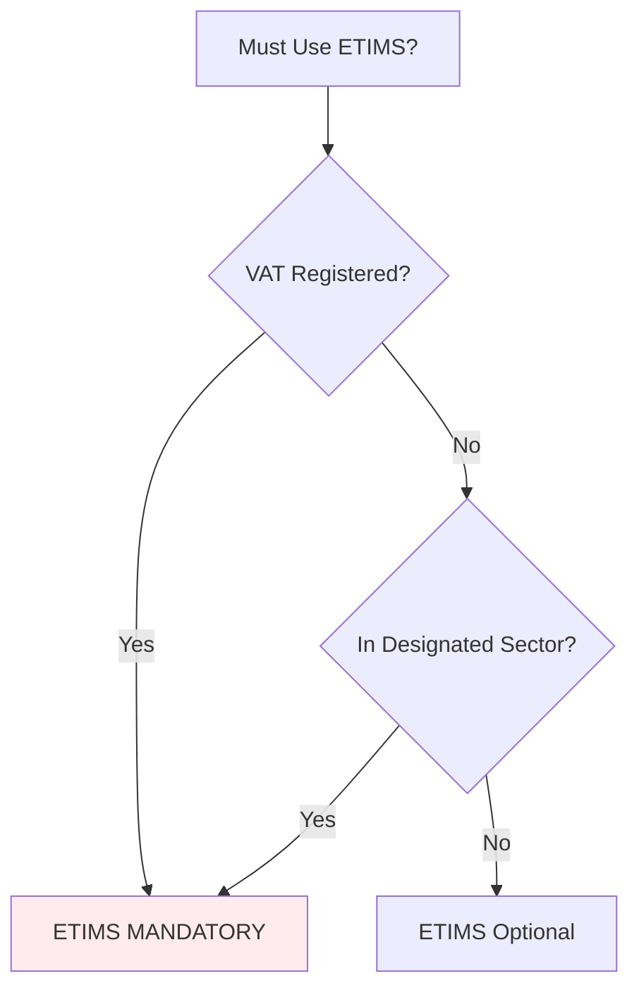

# **📱 ETIMS COMPREHENSIVE GUIDE: KENYAN ELECTRONIC TAX INVOICE SYSTEM**

**Advisor:** Sarah Mwangi, CPA(K) – ETIMS Compliance Specialist

---

## **⚠️ CRITICAL DISCLAIMER**

> _This guidance explains Kenya's Electronic Tax Invoice Management System (ETIMS) based on current KRA regulations. ETIMS requirements evolve frequently—verify with KRA's official channels or your ICPAK accountant. I provide educational information, not official KRA advice._

---

## **🎯 WHAT IS ETIMS?**

**ETIMS** = **E**lectronic **T**ax **I**nvoice **M**anagement **S**ystem

```
KRA'S DEFINITION:
"A system that ensures all VAT-registered taxpayers issue electronic tax invoices
and transmit transaction data to KRA in real-time or near real-time."
```

### **Simple Analogy:**

```
OLD SYSTEM (Manual):
You → Issue paper invoice → Keep copy → File VAT return quarterly

NEW SYSTEM (ETIMS):
You → Issue digital invoice → KRA validates instantly → KRA stores automatically
```

---

## **🔍 WHO MUST USE ETIMS? (2024-2026 MANDATE)**

### **Mandatory Categories:**



### **Specific Mandatory Sectors:**

```
1. ALL VAT-REGISTERED BUSINESSES:
   • Turnover > KES 5 million annually
   • Or voluntarily registered for VAT

2. DESIGNATED SECTORS (Regardless of turnover):
   • Supermarkets, wholesalers, retailers
   • Hotels, restaurants, bars
   • Transport services (matatus, taxis, buses)
   • Professionals (lawyers, accountants, doctors)
   • Manufacturers and processors
   • Importers and exporters
   • B2B service providers

3. AIRBNB/HOSPITALITY SPECIFIC:
   • If VAT registered (turnover > KES 5M)
   • If in Nairobi/Mombasa tourism zones
   • If offering additional services (tours, transport)
```

### **For Your Airbnb Business (Benealpha Ltd):**

```
CURRENT STATUS CHECK:
• Annual turnover expected: [You need to estimate]
• If > KES 5M: ETIMS MANDATORY
• If < KES 5M but in Nairobi: Likely mandatory
• Best practice: Implement ETIMS from start
```

---

## **⚙️ HOW ETIMS WORKS: TECHNICAL FLOW**

### **Real-Time Invoice Flow:**

```
YOUR BUSINESS → ETIMS → KRA → CUSTOMER

STEP 1: You create invoice in ETIMS software
STEP 2: Software sends to KRA for validation
STEP 3: KRA validates, assigns unique number
STEP 4: KRA stores invoice in their database
STEP 5: Invoice delivered to customer with KRA validation
STEP 6: Data automatically included in your VAT return
```

### **Key Technical Components:**

```
1. ETIMS SOFTWARE:
   • KRA-approved application
   • Connects to KRA servers via API
   • Can be cloud-based or installed locally

2. ETIMS DEVICE (For retail/point-of-sale):
   • Physical device for shops
   • Issues receipts with QR codes
   • Often called "ETR Machine"

3. KRA BACKEND:
   • Receives and validates all invoices
   • Stores for 7+ years
   • Cross-checks buyer/seller data
```

---

## **💼 ETIMS REQUIREMENTS FOR AIRBNB BUSINESSES**

### **Special Considerations for Short-Term Rentals:**

```
UNIQUE CHALLENGES:
1. International guests may not have KRA PIN
2. Instant invoice requirement (at check-in)
3. Multiple payment methods (card, cash, M-Pesa)
4. Variable pricing (seasonal rates)

SOLUTIONS:
• Use "Visitor PIN" for foreign guests
• Mobile ETIMS solutions for on-site issuance
• Integration with booking platforms
• Bulk invoice generation for groups
```

### **Airbnb-Specific ETIMS Workflow:**

```
PRE-CHECK-IN:
1. Generate proforma invoice in ETIMS
2. Send to guest via WhatsApp/email
3. Include payment instructions

AT CHECK-IN:
1. Issue final ETIMS invoice
2. Include all services (cleaning, extras)
3. Capture guest details (passport for foreigners)

POST-STAY:
1. Issue credit notes for refunds
2. Generate monthly summary invoices
3. Reconcile with Airbnb payout statements
```

---

## **📱 ETIMS SOFTWARE OPTIONS FOR SMEs**

### **Comparison Table:**

| Software              | Monthly Cost     | Best For                 | ETIMS Compliance | Setup Fee  |
| --------------------- | ---------------- | ------------------------ | ---------------- | ---------- |
| **KRA Free Portal**   | KES 0            | Micro businesses         | Basic            | KES 0      |
| **QuickBooks Online** | KES 3,500-7,000  | SMEs, Service businesses | Full             | KES 5,000  |
| **Sage Pastel**       | KES 5,000-10,000 | Trading, Inventory       | Full             | KES 15,000 |
| **Zoho Books**        | KES 2,000-4,000  | Startups                 | Full             | KES 3,000  |
| **Local Solutions**   | KES 1,000-3,000  | Simple businesses        | Basic            | KES 2,000  |

### **Recommended for Airbnb:**

```
OPTION A: QUICKBOOKS ONLINE (Recommended)
• Reason: Easy integration with bank feeds
• Monthly: KES 3,500
• ETIMS: Fully compliant
• Mobile app: Yes
• Support: Good local support

OPTION B: KRA PORTAL + SIMPLE SPREADSHEETS
• Reason: Cost-saving for first 6 months
• Monthly: KES 0
• ETIMS: Basic compliance
• Manual: More work but cheaper
```

---

## **📋 ETIMS INVOICE REQUIREMENTS (MUST-HAVE FIELDS)**

### **Mandatory Fields on Every ETIMS Invoice:**

```
1. SELLER DETAILS:
   • Business name (exactly as in KRA records)
   • KRA PIN (Format: P000000000X)
   • Physical address
   • ETIMS serial number (from KRA)

2. BUYER DETAILS:
   • Name (individual/company)
   • KRA PIN (if Kenyan business)
   • Phone number/email
   • For foreigners: Passport number, nationality

3. INVOICE DETAILS:
   • ETIMS invoice number (KRA-assigned)
   • Date and time of issue
   • Description of services
   • Quantity, unit price, total
   • VAT amount (16% separately shown)
   • Payment method
   • QR code for validation

4. KRA VALIDATION:
   • "Validated by KRA" statement
   • Unique transaction ID
   • Timestamp of validation
```

### **Sample Airbnb ETIMS Invoice:**

```
===========================================
         ETIMS TAX INVOICE
===========================================
Invoice No: ETIMS-2024-001-0001234
Date: 15/03/2024 14:30:45
Valid Until: 15/04/2024

SELLER:
Benealpha Ltd
KRA PIN: P051234567K
Address: ABC Road, Nairobi
ETIMS Serial: ETIMS-001-2024-7890

BUYER:
John Smith (USA)
Passport: USA1234567
Email: john@email.com

===========================================
DESCRIPTION         QTY   PRICE    AMOUNT
===========================================
Apartment Rental    3     8,000    24,000
Cleaning Fee        1     1,500    1,500
Airport Transfer    2     2,000    4,000
-------------------------------------------
Subtotal:                   29,500
VAT (16%):                  4,720
-------------------------------------------
TOTAL:                     KES 34,220
===========================================

Payment: Credit Card (Visa)
Transaction ID: TXN-123456

QR Code: [Scan to verify with KRA]
ETIMS Code: 8A7B6C5D4E3F2G1H0

**** VALIDATED BY KRA - DO NOT DUPLICATE ****
```

---

## **💰 COST OF ETIMS IMPLEMENTATION**

### **Initial Setup Costs:**

```
1. SOFTWARE:
   • QuickBooks Online: KES 5,000 setup
   • Annual subscription: KES 42,000

2. HARDWARE (Optional):
   • Tablet for mobile invoicing: KES 15,000-30,000
   • Printer: KES 8,000-15,000
   • Barcode scanner: KES 3,000-5,000

3. TRAINING:
   • Staff training: KES 5,000-10,000
   • Accountant setup: KES 10,000-20,000

4. INTERNET:
   • Reliable connection: KES 3,000-5,000/month
   • Backup mobile data: KES 1,000-2,000/month

TOTAL ESTIMATED: KES 50,000-100,000 first year
```

### **Ongoing Monthly Costs:**

```
• Software subscription: KES 3,500-7,000
• Internet: KES 3,000-5,000
• Maintenance/support: KES 2,000-5,000
• Total monthly: KES 8,500-17,000
```

---

## **🚀 IMPLEMENTATION TIMELINE FOR AIRBNB**

### **4-Week Implementation Plan:**

```
WEEK 1: PLANNING & SELECTION
• Research ETIMS software options
• Consult with accountant
• Choose solution
• Budget approval

WEEK 2: SETUP & CONFIGURATION
• Purchase/subscribe to software
• Configure for Airbnb business
• Set up invoice templates
• Test with dummy transactions

WEEK 3: STAFF TRAINING & TESTING
• Train cleaning/management staff
• Test full workflow
• Generate test invoices
• Resolve any issues

WEEK 4: GO LIVE & MONITORING
• Start issuing real ETIMS invoices
• Monitor system performance
• Collect guest feedback
• Adjust as needed
```

### **Critical Success Factors:**

```
1. INTERNET RELIABILITY:
   • Have backup connection
   • Offline mode capability
   • Regular speed tests

2. STAFF COMPETENCE:
   • Simple, clear procedures
   • Training manuals
   • Emergency contacts

3. GUEST EXPERIENCE:
   • Fast invoice generation
   • Multiple delivery options
   • Clear explanations
```

---

## **⚖️ LEGAL & COMPLIANCE REQUIREMENTS**

### **Record-Keeping Requirements:**

```
MUST KEEP FOR 7 YEARS:
1. All ETIMS invoices issued
2. Credit/debit notes
3. Receipts of ETIMS transmission
4. System audit trails
5. KRA validation confirmations

DIGITAL STORAGE:
• Cloud backup recommended
• Local backup mandatory
• Encrypted storage
• Regular testing of backups
```

### **Penalties for Non-Compliance:**

```
TIER 1: MINOR INFRACTIONS
• Late ETIMS registration: KES 10,000
• Incorrect invoice details: KES 5,000 per invoice
• Failure to issue invoice: KES 1,000 per instance

TIER 2: SERIOUS INFRACTIONS
• Deliberate non-use: KES 10,000 per month
• Fraudulent invoices: KES 20,000 per invoice
• System tampering: KES 100,000+

TIER 3: CRIMINAL OFFENSES
• Tax evasion using fake invoices
• Business license suspension
• Director prosecution
• Possible imprisonment
```

### **Audit Triggers:**

```
KRA MAY AUDIT IF:
• ETIMS invoices don't match bank deposits
• Missing invoices in KRA system
• Consistent late submissions
• Large volume of credit notes
• Discrepancies with Airbnb reports
```

---

## **🔄 INTEGRATION WITH OTHER SYSTEMS**

### **ETIMS + Accounting Software:**

```
IDEAL WORKFLOW:
1. ETIMS generates invoice
2. Automatically posts to accounting software
3. Payment received → matched in software
4. VAT return auto-calculated
5. Reports generated for management

RECOMMENDED INTEGRATIONS:
• QuickBooks + ETIMS module
• Xero + Kenyan ETIMS add-on
• Sage + ETIMS integration
```

### **ETIMS + Payment Systems:**

```
FOR AIRBNB PAYMENTS:
1. Airbnb payout → Bank account
2. Bank statement imported to accounting
3. Matched with ETIMS invoices
4. Reconciliation report generated

ADDITIONAL PAYMENT METHODS:
• M-Pesa: Generate invoice after payment
• Card: Invoice at time of payment
• Cash: Immediate ETIMS invoice
• Bank transfer: Invoice upon confirmation
```

### **ETIMS + Property Management:**

```
POSSIBLE INTEGRATIONS:
• Booking calendar → ETIMS invoice
• Check-in system → Automatic invoicing
• Maintenance requests → Expense tracking
• Guest communication → Invoice delivery
```

---

## **💡 PRACTICAL TIPS FOR AIRBNB HOSTS**

### **Tip 1: Handle Foreign Guests Properly**

```
PROCEDURE:
1. Collect passport details at booking
2. Use "Visitor" category in ETIMS
3. Generate invoice with passport number
4. Keep copy for 7 years
5. Provide digital copy to guest

IMPORTANT: Foreign guests don't need KRA PIN
```

### **Tip 2: Manage Multiple Services**

```
EXAMPLE INVOICE STRUCTURE:
• Line 1: Accommodation (VATable)
• Line 2: Cleaning (VATable)
• Line 3: Airport transfer (VATable)
• Line 4: Tour service (VATable)
• Total VAT calculated automatically
```

### **Tip 3: Handle Refunds/Cancellations**

```
ETIMS REQUIREMENT:
1. CANCEL original invoice in system
2. Issue credit note with reference
3. Reason must be specified:
   • Cancellation
   • Early departure
   • Service complaint
   • Price adjustment
```

### **Tip 4: Monthly Reporting**

```
END OF MONTH PROCESS:
1. Generate monthly invoice summary
2. Reconcile with Airbnb payout
3. Check all invoices validated by KRA
4. Prepare VAT return (if registered)
5. Archive all documents
```

---

## **🚨 COMMON PITFALLS & SOLUTIONS**

### **Pitfall 1: Internet Connectivity Issues**

```
SOLUTION:
• Use ETIMS with offline capability
• Generate invoices offline, sync when online
• Maximum offline period: 72 hours
• Have mobile hotspot backup
```

### **Pitfall 2: Guest Without Details**

```
SOLUTION:
• Have digital form for guest details
• Capture at booking or check-in
• Basic details minimum: Name, contact
• Update ETIMS later if needed
```

### **Pitfall 3: Multiple Property Locations**

```
SOLUTION:
• Each location needs separate ETIMS registration
• Centralized management possible
• Consolidated reporting
• Separate invoice numbering per location
```

### **Pitfall 4: Staff Turnover**

```
SOLUTION:
• Standard operating procedures
• Training manuals
• Limited access rights
• Audit trails of all actions
```

---

## **📊 BENEFITS OF ETIMS FOR AIRBNB BUSINESS**

### **Operational Benefits:**

```
1. AUTOMATED RECORD-KEEPING:
   • No manual filing
   • Easy retrieval
   • Digital archive

2. REAL-TIME MONITORING:
   • Daily revenue tracking
   • Occupancy analysis
   • Expense monitoring

3. GUEST PROFESSIONALISM:
   • Official KRA-validated invoices
   • Professional image
   • Easier expense claims for business guests
```

### **Compliance Benefits:**

```
1. AUTOMATED TAX CALCULATIONS:
   • VAT computed correctly
   • Withholding tax tracked
   • Reports ready for filing

2. AUDIT PREPAREDNESS:
   • All records KRA-ready
   • Digital audit trail
   • Reduced audit stress

3. AVOIDANCE OF PENALTIES:
   • Timely filing
   • Accurate reporting
   • Compliance history
```

### **Financial Benefits:**

```
1. BETTER CASH FLOW MANAGEMENT:
   • Real-time revenue tracking
   • Expense monitoring
   • Profitability analysis

2. FINANCING READINESS:
   • Clean financial records
   • Bank-ready reports
   • Valuation support

3. BUSINESS VALUATION:
   • Documented revenue streams
   • Compliance history
   • Professional operations
```

---

## **✅ ETIMS READINESS CHECKLIST**

### **Technical Readiness:**

- [ ] Reliable internet connection available
- [ ] Backup internet option identified
- [ ] Compatible devices available
- [ ] Power backup (UPS/generator)
- [ ] Data backup system in place

### **Staff Readiness:**

- [ ] Key staff identified and trained
- [ ] Emergency procedures documented
- [ ] Support contacts available
- [ ] Training materials prepared

### **Process Readiness:**

- [ ] Invoice templates created
- [ ] Guest data collection process
- [ ] Payment reconciliation process
- [ ] Refund/cancellation procedure
- [ ] Monthly reporting process

### **Compliance Readiness:**

- [ ] KRA PIN verified
- [ ] Business details updated with KRA
- [ ] ETIMS registration completed
- [ ] Software KRA-approved
- [ ] Accountant consulted

---

## **📞 SUPPORT RESOURCES**

### **Official KRA Support:**

```
• ETIMS Helpdesk: 020 499 9999
• Email: etims@kra.go.ke
• iTax Support: 020 4 999 999
• Website: www.kra.go.ke/etims
• Walk-in: Times Tower, Nairobi
```

### **Professional Support:**

```
• ICPAK Members Directory: Find accountants
• Software Vendor Support: Included in subscriptions
• Business Associations: KEPSA, KNCCI
• Digital Tax Experts: Specialized consultants
```

### **Training Resources:**

```
• KRA ETIMS Training Portal: Online courses
• YouTube: KRA official channel
• Software Vendor Training: Often free with subscription
• ICPAK Workshops: Regular compliance training
```

---

## **🎯 FINAL RECOMMENDATION FOR BENEALPHA**

### **Immediate Action Plan:**

```
STEP 1: ASSESS REQUIREMENT
• Estimate annual turnover
• Check if in mandatory sector
• Consult with accountant

STEP 2: SELECT SOLUTION
• QuickBooks Online recommended
• Budget: KES 50,000 first year
• Timeline: 4 weeks implementation

STEP 3: IMPLEMENT IN PHASES
• Phase 1: Basic ETIMS for Airbnb
• Phase 2: Integration with accounting
• Phase 3: Advanced features

STEP 4: TRAIN & GO LIVE
• Train cleaning/management staff
• Start with simple invoices
• Expand as comfort grows
```

### **Long-Term Strategy:**

```
YEAR 1: COMPLIANCE FOUNDATION
• Implement ETIMS properly
• Build compliance history
• Establish good processes

YEAR 2: OPTIMIZATION
• Integrate with other systems
• Automate reporting
• Expand to multiple properties

YEAR 3: SCALING
• Advanced ETIMS features
• Multi-location management
• Data analytics for business decisions
```

---

**🏁 Key Takeaway:** ETIMS is not just about compliance—it's a business upgrade. For Airbnb hosts, it provides professional invoicing, automated record-keeping, and peace of mind. Starting with ETIMS from day one positions your business for growth, financing, and potential sale.

**Would you like me to:**

1. **Create a step-by-step ETIMS implementation checklist** for Airbnb businesses?
2. **Provide specific software configuration instructions** for QuickBooks Online?
3. **Draft ETIMS procedures manual** for your cleaning/management staff?
4. **Build an ETIMS cost-benefit analysis** specific to your expected revenue?
