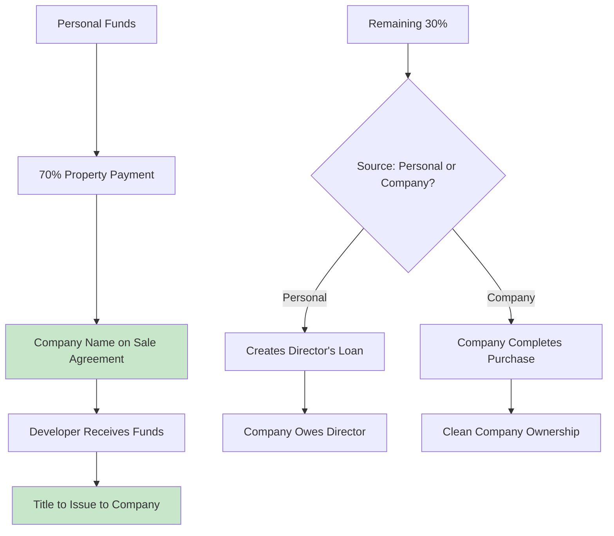

# **🏡 OPTIMAL TRANSFER STRATEGY: COMPANY-FIRST OWNERSHIP**

**Advisor:** Sarah Mwangi, CPA(K) – Specializing in Corporate Property Holdings

---

## **⚠️ CRITICAL DISCLAIMER**

> _This guidance is based on provided information. Property transfer and company structuring have significant legal and tax implications. Consult with both a practicing ICPAK accountant and real estate lawyer before implementing. I provide educational guidance, not binding professional advice._

---

## **🎯 EXCELLENT NEWS: YOU'RE IN THE IDEAL POSITION!**

Your current structure is **nearly perfect** for tax optimization:

```
✅ OPTIMAL STARTING POINT:
• Sale Agreement already in Company name ✓
• Title will issue directly to Company ✓
• No transfer needed ✓
• 70% already paid from personal ✓
• 30% remaining to complete ✓
• No mixed use (clean business property) ✓
```

---

## **🔍 CURRENT SITUATION ANALYSIS**

### **Current Ownership Flow**



### **Key Advantage You Have**

```
MOST BUSINESSES PAY EXTRA FOR THIS STRUCTURE:
• Title issuing directly to company: SAVES 4-8% stamp duty
• No transfer taxes: SAVES capital gains tax
• Clean ownership from start: SAVES legal fees
• Your situation: Already set up optimally!
```

---

## **📊 RECOMMENDED STRUCTURE: DIRECTOR'S LOAN MODEL**

### **Final 30% Payment Strategy**

```
OPTION A: Personal Pays Remaining 30% (Recommended)
• Personal pays final installment to developer
• Total personal investment = 100% of property
• Company records as DIRECTOR'S LOAN
• Company repays director over time
• Interest: Commercial rate (10-12% recommended)

OPTION B: Company Pays from Operations
• Wait until company generates Airbnb income
• Use rental income to pay final installment
• Delay may risk developer penalties
• Personal exposure: Only 70%

OPTION C: Mix of Both
• Personal pays some, company pays some
• Complex accounting but flexible
```

### **Recommended: Option A with Formal Loan Agreement**

```markdown
**DIRECTOR'S LOAN STRUCTURE:**

1. LOAN AMOUNT:
   • Total personal payments (70% + 30%)
   • Example: Property KES 10M, Loan = KES 10M

2. INTEREST TERMS:
   • Rate: 10% per annum (commercial rate)
   • Repayment: Monthly/Quarterly from rental income
   • Term: 5-7 years (matches Airbnb cash flow)

3. SECURITY:
   • Company property as collateral
   • Registered charge (optional but recommended)
   • Personal guarantee (already implied)

4. TAX COMPLIANCE:
   • Company deducts interest expense
   • Personal declares interest income
   • Withholding tax: 15% on interest payments
```

---

## **💰 TAX OPTIMIZATION STRATEGY**

### **Stamp Duty Savings Calculation**

```
WITH YOUR STRUCTURE:
• Stamp duty paid ONCE by company: 2-4% of KES 10M = KES 200,000-400,000

VS ALTERNATIVE (Personal then transfer):
• Personal pays: KES 200,000-400,000
• Company pays again: KES 200,000-400,000
• Total: KES 400,000-800,000

YOUR SAVINGS: KES 200,000-400,000
```

### **Interest Expense Deduction Benefit**

```
ANNUAL INTEREST EXPENSE (Example):
Loan: KES 10,000,000
Interest rate: 10%
Annual interest: KES 1,000,000

TAX SAVING FOR COMPANY:
Company tax rate: 30%
Tax saving: KES 1,000,000 × 30% = KES 300,000/year

NET COST TO COMPANY:
Interest paid: KES 1,000,000
Less tax saving: KES 300,000
Net cost: KES 700,000
```

### **Personal Tax on Interest Income**

```
PERSONAL RECEIVES:
Interest income: KES 1,000,000/year
Withholding tax (15%): KES 150,000 (deducted by company)
Net received: KES 850,000

PERSONAL TAX:
Taxable income: KES 850,000
Personal tax (approx): KES 187,000
Net after tax: KES 663,000

OVERALL FAMILY BENEFIT:
Company saves: KES 300,000
Personal receives after tax: KES 663,000
Total benefit: KES 963,000
Less interest cost: KES 1,000,000
Net tax efficiency: -KES 37,000 (but money moves within family)
```

---

## **📋 IMMEDIATE ACTION PLAN (MARCH START)**

### **Week 1: Documentation & Compliance**

```
PRIORITY 1: DOCUMENT EXISTING LOAN
• Prepare Director's Loan Agreement for 70% already paid
• Board resolution approving loan
• Update company accounts
• File with company registrar (optional but recommended)

PRIORITY 2: FINAL PAYMENT PREPARATION
• Confirm exact remaining amount with developer
• Agree completion date
• Prepare funds transfer
• Schedule title processing

PRIORITY 3: AIRBNB READINESS
• Apply for county permits (urgent!)
• Schedule inspections
• Purchase insurance
• Create guest management system
```

### **Week 2: Final Payment & Title Process**

```
DAY 1-2: FINAL PAYMENT
• Personal transfers remaining 30% to developer
• Get completion certificate
• Update loan agreement to include final payment
• Total loan amount now documented

DAY 3-5: TITLE PROCESSING
• Submit completion documents to lands office
• Pay stamp duty (company responsibility)
• Company pays from operations or director advances
• Expected timeline: 30-60 days for title

DAY 6-7: AIRBNB LAUNCH PREP
• Listing creation
• Photography
• Pricing strategy
• Cleaning team setup
```

### **Week 3: Airbnb Launch & Accounting Setup**

```
AIRBNB LAUNCH (Target: March 15-31):
• Activate listing
• First bookings
• Guest communication system
• Emergency response plan

ACCOUNTING SYSTEM:
• Set up QuickBooks/accounting software
• Create chart of accounts for rental business
• Implement receipt tracking system
• March income/expense tracking begins
```

---

## **📁 ESSENTIAL DOCUMENTS REQUIRED**

### **1. Director's Loan Agreement**

```markdown
**KEY SECTIONS:**

1. PARTIES:
   Lender: [Your Name], ID No. [Your ID], Director of Benealpha Ltd
   Borrower: Benealpha Ltd, PIN [Company PIN]

2. LOAN AMOUNT:
   Principal: KES [Total Property Cost]
   Breakdown:
   • Initial payments (70%): KES [Amount]
   • Final payment (30%): KES [Amount]
   • Total: KES [Total]

3. INTEREST & REPAYMENT:
   Interest rate: 10% per annum, compounded monthly
   Repayment: Monthly installments of KES [Amount]
   Term: 84 months (7 years)
   Security: First charge on property [Title Number]

4. TAX CLAUSES:
   • Borrower to withhold 15% WHT on interest
   • Lender to provide PIN for tax compliance
   • Both parties maintain records for 7 years

5. GOVERNING LAW:
   • Kenyan law applies
   • Dispute resolution: Arbitration in Nairobi
```

### **2. Board Resolution**

```markdown
**BENEALPHA LTD BOARD RESOLUTION**

DATE: [Current Date]
PRESENT: All Directors

RESOLVED THAT:

1. The company accepts a loan from Director [Your Name] in the amount of KES [Total] for the purchase of property [Address].

2. The loan shall bear interest at 10% per annum, repayable over 84 months.

3. The company shall execute the attached Loan Agreement.

4. The property shall be used exclusively for Airbnb rental business.

5. Director [Your Name] is authorized to complete the final payment to the developer.

SIGNED:

---

[Your Name], Director

---

[Director 2 Name]

---

[Director 3 Name]
```

### **3. Company Accounting Entries**

```
INITIAL ENTRIES:

1. When property purchase completes:
   Debit: Property Asset - KES [Total Cost]
   Credit: Loan from Director - KES [Total Cost]

2. Monthly interest accrual:
   Debit: Interest Expense - KES [Monthly Interest]
   Credit: Accrued Interest Payable - KES [Monthly Interest]

3. Loan repayment entry:
   Debit: Loan from Director - KES [Principal]
   Debit: Accrued Interest Payable - KES [Interest]
   Credit: Cash/Bank - KES [Total Payment]
   Credit: WHT Payable - KES [15% of Interest]
```

---

## **🏛️ COUNTY COMPLIANCE (URGENT FOR MARCH START)**

### **Nairobi County Requirements Timeline**

```
DAY 1-3 (This Week):
• Apply for Single Business Permit (Tourism category)
• Fee: KES 15,000-25,000 (based on property size)
• Online: eJiji portal
• Processing: 7-14 days

DAY 4-7:
• Schedule Public Health Inspection
• Prepare: First aid kit, fire extinguishers, sanitation
• Inspection fee: KES 5,000
• Certificate issuance: 3-5 days after inspection

DAY 8-10:
• Fire Safety Certificate application
• Requirements: Smoke detectors, fire exits marked
• Inspection: County fire department
• Certificate: 5-7 days

DAY 11-14:
• Display all certificates at property
• Update Airbnb listing with permit numbers
• Train cleaning staff on compliance
```

### **Airbnb-Specific Compliance**

```
1. GUEST REGISTER (Mandatory):
   • Physical/digital register
   • Guest details: Name, ID/Passport, nationality, dates
   • Keep for 7 years
   • Police inspection possible

2. SAFETY REQUIREMENTS:
   • First aid kit
   • Emergency contacts displayed
   • Neighborhood security brief
   • COVID-19 protocols (if still required)

3. TAX DISPLAY:
   • County business permit visible
   • KRA PIN displayed (optional but professional)
```

---

## **📊 FINANCIAL PROJECTIONS & CASH FLOW**

### **Initial Months Cash Flow (Conservative)**

```
MARCH (Partial Month):
• Expected bookings: 15 nights
• Average rate: KES 5,000/night
• Gross income: KES 75,000
• Airbnb fees (3%): KES 2,250
• Cleaning costs: KES 15,000
• Net before other expenses: KES 57,750

APRIL (Full Month):
• Expected bookings: 22 nights
• Average rate: KES 5,000/night
• Gross income: KES 110,000
• Expenses: KES 45,000
• Net operating income: KES 65,000
• Loan repayment (example): KES 15,000
• Net cash flow: KES 50,000
```

### **Loan Repayment Strategy**

```
RECOMMENDED: REINVEST THEN REPAY

MONTHS 1-3:
• Reinforce all income into property
• Build maintenance reserve fund
• Establish operational systems
• Minimum loan repayment only

MONTHS 4-6:
• Regular loan repayments begin
• Target: 50% of free cash flow to loan
• 50% to business expansion/reserves

MONTHS 7-12:
• Accelerated repayment if cash flow allows
• Consider variable repayments tied to occupancy
• Build toward 100% repayment in 5-7 years
```

---

## **🚨 CRITICAL RISKS & MITIGATION**

### **Risk 1: Title Delay Beyond March**

```
MITIGATION:
• Start Airbnb operations under "License to Occupy"
• Get developer letter confirming completion
• Purchase title insurance (optional)
• Document all payments meticulously
```

### **Risk 2: Low Initial Occupancy**

```
MITIGATION:
• Aggressive marketing launch
• Introductory pricing (20-30% below market)
• Partner with local travel agencies
• Offer long-stay discounts
• Ensure stellar reviews from first guests
```

### **Risk 3: Personal Cash Flow Strain**

```
MITIGATION:
• Stagger final payment if developer allows
• Consider short-term personal loan for final payment
• Delay some non-essential property improvements
• Phase Airbnb launch (start with 1-2 bedrooms)
```

### **Risk 4: Company vs Personal Tax Confusion**

```
MITIGATION:
• Separate bank accounts strictly
• All property expenses through company
• Regular dividend declarations (if profitable)
• Annual tax planning with accountant
```

---

## **💼 COMPANY GOVERNANCE REQUIREMENTS**

### **3 Shareholder Structure Considerations**

```
RECOMMENDED SHAREHOLDING:
• Based on capital contribution
• Example: You 70%, Others 30% (if they contributed)
• Document in shareholders agreement
• Dividend policy aligned with loan repayment

DIRECTORS' RESPONSIBILITIES:
• Monthly financial review
• Compliance oversight
• Strategic decisions
• Risk management
```

### **Monthly Management Requirements**

```
WEEK 1 EACH MONTH:
• Review previous month's performance
• Approve payments and expenses
• Update financial projections
• Compliance check (permits, taxes)

WEEK 2 EACH MONTH:
• Marketing strategy review
• Pricing adjustment based on demand
• Maintenance planning
• Guest feedback analysis

END OF MONTH:
• Financial statements preparation
• Tax filing preparation
• Cash flow review
• Strategic planning for next month
```

---

## **📞 PROFESSIONAL SUPPORT TIMELINE**

### **Immediate (This Week)**

```
1. REAL ESTATE LAWYER:
   • Review sale agreement completion
   • Title processing guidance
   • Loan agreement drafting
   • Cost: KES 30,000-50,000

2. ICPAK ACCOUNTANT:
   • Set up company chart of accounts
   • Tax registration (VAT if applicable)
   • Loan documentation advice
   • Cost: KES 20,000-40,000 setup
```

### **Month 1-2 Support**

```
3. PROPERTY MANAGER (Optional):
   • Day-to-day operations
   • Guest communication
   • Cleaning coordination
   • Cost: 15-20% of rental income

4. TAX COMPLIANCE OFFICER:
   • Monthly filing support
   • Record keeping systems
   • KRA correspondence
   • Cost: KES 5,000-10,000/month
```

---

## **✅ CHECKLIST: MARCH LAUNCH READINESS**

### **Legal & Compliance (Due: March 10)**

- [ ] Director's Loan Agreement signed
- [ ] Board resolution passed
- [ ] Final payment to developer completed
- [ ] Title processing documents submitted
- [ ] County business permit application submitted
- [ ] Public health inspection scheduled
- [ ] Insurance purchased

### **Property Readiness (Due: March 15)**

- [ ] Furniture and appliances installed
- [ ] Cleaning supplies stocked
- [ ] Safety equipment (fire extinguisher, first aid)
- [ ] Guest amenities (WiFi, toiletries, kitchen basics)
- [ ] Professional photography completed
- [ ] Cleaning team hired and trained

### **Airbnb Launch (Due: March 20)**

- [ ] Listing created and optimized
- [ ] Pricing strategy set
- [ ] Calendar availability opened
- [ ] House rules and manual prepared
- [ ] Emergency contact system established
- [ ] Key exchange/check-in process defined

### **Financial Systems (Due: March 31)**

- [ ] Company bank account ready for deposits
- [ ] Accounting software set up
- [ ] Expense tracking system implemented
- [ ] Tax compliance calendar created
- [ ] Cash flow projection for Q2 prepared
- [ ] Loan repayment schedule established

---

## **🎯 FINAL RECOMMENDATION: EXECUTION PLAN**

### **Priority 1: Complete Payment & Document Loan**

```
ACTION: Personal pays remaining 30% THIS WEEK
DOCUMENT: Loan agreement for 100% of property cost
REGISTER: Charge on property when title issues (optional)
COMMUNICATE: Inform all directors of structure
```

### **Priority 2: Fast-Track County Compliance**

```
ACTION: Apply for ALL permits THIS WEEK
STRATEGY: Use expedited processing where available
BUDGET: KES 40,000-60,000 for all permits
TIMELINE: Target all permits by March 20
```

### **Priority 3: Airbnb Launch Excellence**

```
ACTION: Premium listing with professional photos
PRICING: Competitive introductory rates
REVIEWS: Focus on 5-star first guests
SYSTEMS: Automated guest communication
```

### **Priority 4: Financial Discipline**

```
RULE 1: All income to company account
RULE 2: All expenses documented with receipts
RULE 3: Monthly financial review with directors
RULE 4: Tax provisioning from day one (30% of profit)
```

---

## **💰 FUNDING STRATEGY FOR REMAINING 30%**

### **Option 1: Personal Funds (Simplest)**

```
• Immediate availability
• Clean documentation
• Full control
• Consider personal loan if cash tight
```

### **Option 2: Company Borrowing**

```
• Business loan against future rental income
• More complex but separates personal/company
• Higher interest likely
• Requires business plan and projections
```

### **Option 3: Staggered Payment to Developer**

```
• Negotiate 15% now, 15% in 60 days
• Use initial Airbnb income for second payment
• Risk: Developer may refuse
• Potential penalty interest
```

**Recommendation:** Use personal funds if available, document as additional director's loan, begin aggressive repayment from Airbnb income.

---

## **🏁 SUCCESS METRICS FOR MONTH 1**

### **Operational Targets:**

- [ ] 60% occupancy rate achieved
- [ ] Average daily rate: KES 5,000+
- [ ] 4.8+ star average rating
- [ ] 0 compliance issues with county

### **Financial Targets:**

- [ ] Gross revenue: KES 75,000+ (March partial)
- [ ] Operating profit margin: 40%+
- [ ] Tax provisions: 30% of profit set aside
- [ ] Loan repayment: First installment made

### **Compliance Targets:**

- [ ] All county permits obtained
- [ ] Guest register maintained
- [ ] Monthly tax filings on schedule
- [ ] Insurance active and adequate

---

**You're in an enviable position with the sale agreement already in the company name. This saves significant time, money, and complexity. The focus now should be on execution: complete payment, launch operations, and maintain impeccable records from day one.**

**Would you like me to:**

1. **Draft the complete Director's Loan Agreement** with all Kenyan compliance clauses?
2. **Create a county-by-county permit checklist** based on your property location?
3. **Provide a sample Airbnb operations manual** for your cleaning and guest management team?
4. **Build a 12-month financial projection model** including loan repayment scenarios?
