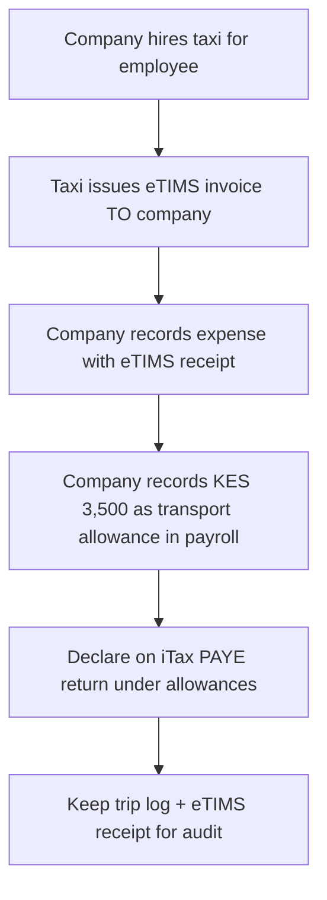

# Kenya Employee Tax Guide (2026)

## Tax-Exempt vs. Taxable Items for Employers & Employees

> **Disclaimer:** This document provides general guidance based on Kenya's Income Tax Act and Finance Acts 2024/2025. Always consult a CPA(K) registered with ICPAK for payroll decisions affecting your employees' tax positions.

---

## 📌 Quick Reference Summary

| Category                                            | Tax Status | Key Threshold/Limit                                   |
| --------------------------------------------------- | ---------- | ----------------------------------------------------- |
| Basic salary (first KES 24,000/month)               | ✅ Exempt  | After personal relief                                 |
| Daily travel allowance (official duties)            | ✅ Exempt  | ≤ KES 10,000/day                                      |
| Transport reimbursement (with receipts)             | ✅ Exempt  | Actual cost                                           |
| Non-cash benefits                                   | ✅ Exempt  | First KES 36,000/year                                 |
| Gratuity (private sector, earned after 1 July 2025) | ✅ Exempt  | Full amount                                           |
| Housing allowance/benefit                           | ⚠️ Taxable | 15% of total income or market rent (whichever higher) |
| Company vehicle (personal use)                      | ⚠️ Taxable | 2% of vehicle value/month                             |
| Cash allowances (non-exempt)                        | ⚠️ Taxable | Full amount                                           |
| Overtime pay                                        | ⚠️ Taxable | Full amount                                           |

---

## ✅ Tax-Exempt Items (No PAYE Applies)

### 1. Basic Income Threshold

- First **KES 24,000/month** (KES 288,000/year) tax-free after personal relief
- _Legal basis:_ Income Tax Act, Section 8

### 2. Travel & Transport Benefits

| Type                       | Exemption Details                                 | Documentation Required                 |
| -------------------------- | ------------------------------------------------- | -------------------------------------- |
| **Daily travel allowance** | Up to **KES 10,000/day** for official duties      | Trip log, venue details                |
| **Mileage reimbursement**  | Actual fuel/tolls at Automobile Association rates | Receipts + mileage log                 |
| **Taxi/bus transport**     | Full cost if for official duties                  | eTIMS invoice from supplier + trip log |

> 💡 **Finance Act 2025 update:** Daily allowance limit increased from KES 2,000 to KES 10,000/day

### 3. Medical Benefits

- Employer-paid medical insurance premiums → **fully exempt**
- Reimbursed medical expenses → **exempt** with proper receipts
- _Legal basis:_ Income Tax Act, Section 5(2)(f)

### 4. Retirement & Pension

| Item                          | Exemption Details                                      |
| ----------------------------- | ------------------------------------------------------ |
| **Gratuity (private sector)** | **Fully exempt** if earned on/after 1 July 2025        |
| **Non-commuted pension**      | First KES 300,000/year exempt                          |
| **NSSF contributions**        | Employee's 6% (up to KES 6,480/month) → tax-deductible |

### 5. Statutory Deductions (Tax-Deductible)

| Contribution     | Rate                      | Cap (Monthly)                  | Tax Treatment                  |
| ---------------- | ------------------------- | ------------------------------ | ------------------------------ |
| **NSSF Tier I**  | 6% employee + 6% employer | KES 6,480 (effective Feb 2026) | Deductible from taxable income |
| **SHIF**         | 2.75% employee            | Based on gross pay             | Deductible from taxable income |
| **Housing Levy** | 1.5% employee             | Based on gross pay             | Deductible from taxable income |

### 6. Special Exemptions

- **Persons with Disability (PWD):** First KES 150,000/month tax-free (vs. KES 24,000 standard)
- **Non-cash benefits threshold:** First KES 36,000/year exempt (Finance Act 2024 increased from KES 18,000)
- **Insurance relief:** 15% relief on health/education premiums up to KES 60,000/year

---

## ⚠️ Taxable Items (Subject to PAYE)

### 1. Core Employment Income

| Item                         | Tax Treatment                  | Calculation                       |
| ---------------------------- | ------------------------------ | --------------------------------- |
| **Basic salary**             | Taxable above KES 24,000/month | Progressive rates: 10% → 30%      |
| **Overtime pay**             | Fully taxable                  | Added to gross monthly pay        |
| **Bonuses/commissions**      | Fully taxable                  | Added to gross monthly pay        |
| **Board sitting allowances** | Fully taxable                  | Not covered by per diem exemption |

### 2. Housing Benefits

- **Housing allowance:** Taxable as **higher of:**
  - 15% of total employment income, OR
  - Actual market rental value of accommodation
- _Legal basis:_ Income Tax Act, Section 5(3)

### 3. Transport & Vehicle Benefits

| Scenario                               | Tax Treatment                          |
| -------------------------------------- | -------------------------------------- |
| Transport allowance > KES 10,000/day   | Excess amount taxable                  |
| Company vehicle for personal use       | 2% of vehicle's market value per month |
| Fuel paid by employer for personal use | Full value taxable                     |

### 4. Other Taxable Benefits

| Item                             | Threshold              | Tax Treatment                                            |
| -------------------------------- | ---------------------- | -------------------------------------------------------- |
| **Non-cash benefits**            | > KES 36,000/year      | Value exceeding threshold taxable                        |
| **Low-interest loans**           | Interest below 8% p.a. | Deemed interest taxed at 15% withholding                 |
| **School fees paid by employer** | Any amount             | Fully taxable (unless under approved scholarship scheme) |

---

## 🔑 Critical Compliance Rules for 2026

### ✅ What Goes Into eTIMS

- **Sales transactions** (B2B/B2C invoices)
- **Supplier invoices** you receive (e.g., taxi company invoice for employee transport)
- **NOT employee payroll/benefits** — these are **explicitly exempt** from eTIMS

### 📋 Proper Documentation Flow (Transport Example)

### ⚠️ KRA's 2026 Validation Rule

> All expense claims on your corporate tax return will be cross-checked against **valid eTIMS invoices from suppliers**.  
> ❌ Missing eTIMS receipts = disallowed expense + penalties

---

## 📊 PAYE Calculation Example (Monthly)

**Employee Details:**

- Basic salary: KES 80,000
- Transport allowance (official duties): KES 8,000
- Housing allowance: KES 15,000

| Step                         | Calculation                                                          | Amount (KES)   |
| ---------------------------- | -------------------------------------------------------------------- | -------------- |
| 1. Gross taxable income      | 80,000 + 15,000                                                      | 95,000         |
| 2. Less: Personal relief     |                                                                      | (2,400)        |
| 3. Less: NSSF (6%)           | 6% × 80,000                                                          | (4,800)        |
| 4. Less: SHIF (2.75%)        | 2.75% × 80,000                                                       | (2,200)        |
| 5. Less: Housing Levy (1.5%) | 1.5% × 80,000                                                        | (1,200)        |
| 6. **Taxable income**        |                                                                      | **84,400**     |
| 7. PAYE calculation          | 10% × 24,000 = 2,400 25% × 8,333 = 2,083 30% × 52,067 = 15,620 | **20,103**     |
| 8. **Net PAYE payable**      |                                                                      | **KES 20,103** |

> 💡 Transport allowance (KES 8,000) excluded because ≤ KES 10,000/day threshold

---

## 📥 Where to Declare Items

| Item Type                          | System     | Form/Section                             |
| ---------------------------------- | ---------- | ---------------------------------------- |
| Salary & taxable allowances        | iTax       | Monthly PAYE Return (Form P9A)           |
| Tax-exempt allowances              | iTax       | Monthly PAYE Return (allowances section) |
| Fringe Benefit Tax (if applicable) | iTax       | Separate FBT Return (16% rate)           |
| Supplier expenses (e.g., taxi)     | Your books | Expense ledger + eTIMS receipt filing    |
| Annual reconciliation              | iTax       | Annual Return (Form P3)                  |

---

## 🔍 Audit Checklist: Transport Benefits

Before KRA audit, ensure you have:

- [ ] Trip logs showing dates, venues, and business purpose
- [ ] Valid eTIMS invoices from taxi/bus companies
- [ ] Payroll records showing allowance amounts ≤ KES 10,000/day
- [ ] iTax PAYE returns declaring allowances correctly
- [ ] Policy document defining "official duties" transport

---

> **Prepared:** February 2026  
> **Source:** Income Tax Act (Cap 470), Finance Acts 2024 & 2025, KRA Public Rulings  
> **⚠️ Not a substitute for professional tax advice. Consult a CPA(K) for your specific situation.**
